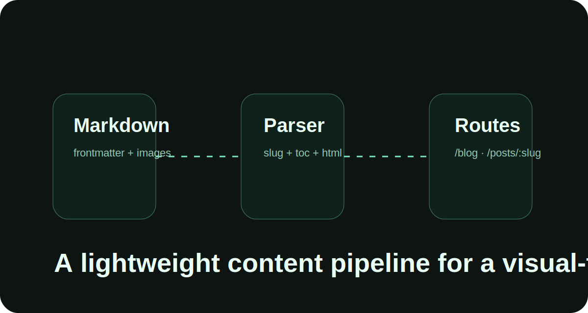
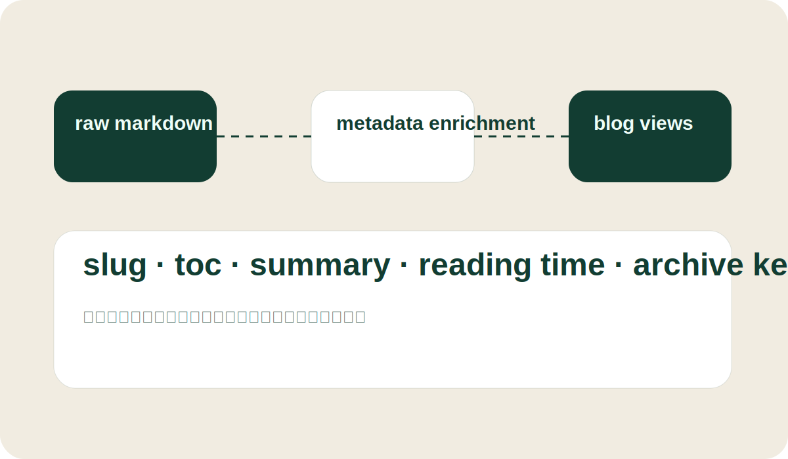

## 一层很轻的内容入口

我不想一上来就接数据库或者 CMS。对于这个阶段的个人站点来说，本地 Markdown 足够快，也更适合边写边改。

所以我给文章系统设定的规则非常简单：

- 每篇文章一个目录；
- `index.md` 负责正文和 Frontmatter；
- 同目录放插图或封面；
- 由前端在构建时统一收集和解析。

## 文章在运行时会被补齐哪些信息

当文章被读入以后，系统会额外生成这些数据：

### 文章 slug

来自目录名，用于生成 `/posts/:slug` 路由。

### 目录 TOC

解析 Markdown 后扫描标题层级，自动生成侧边目录。

### 阅读时长

根据正文纯文本长度估算，这样列表页和详情页都能显示一个简单的阅读提示。

### 时间归档键

将日期进一步整理成 `2026-04` 这种键值，方便总览页做归档视图。

## 为什么不先把文章放进 public

`public` 更适合不需要参与模块图的静态资源，比如 favicon、下载文件或者站点级通用图片。文章源如果放进去，通常会遇到两个问题：

1. 不方便直接通过模块收集；
2. 同目录图片不会自动进入构建资源映射。

因此这次我把文章内容放进 `src/content/posts`，这样文章和图片可以作为一个整体被处理。

## 后面还能怎么扩展

如果后续内容变多，我会继续补这些能力：

- 自动生成摘要；
- 搜索和筛选；
- 系列文章、前后篇；
- 草稿和发布日期控制；
- 更细的 Markdown 组件定制。

目前这个版本足够轻，也足够稳定，适合作为博客系统的起点。
