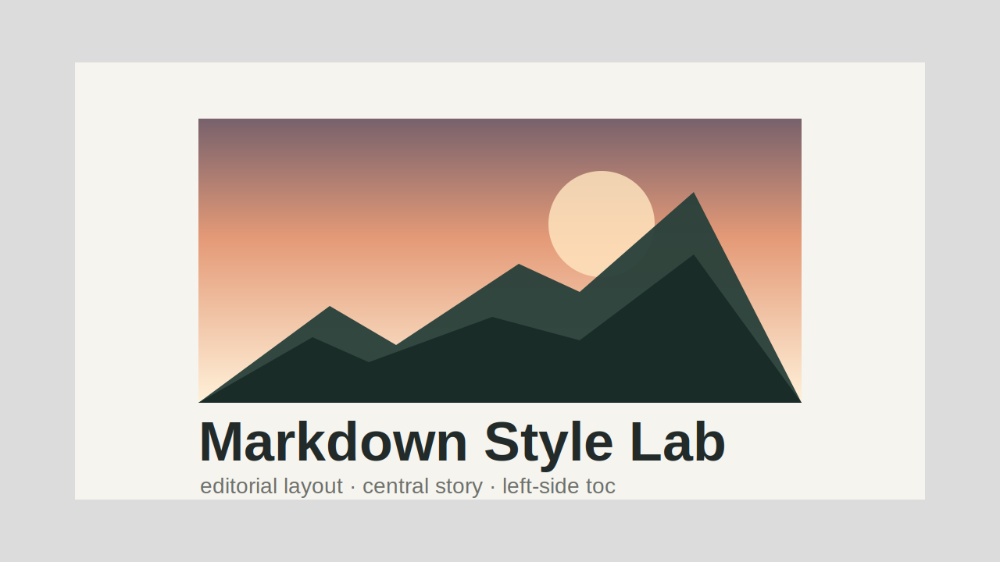
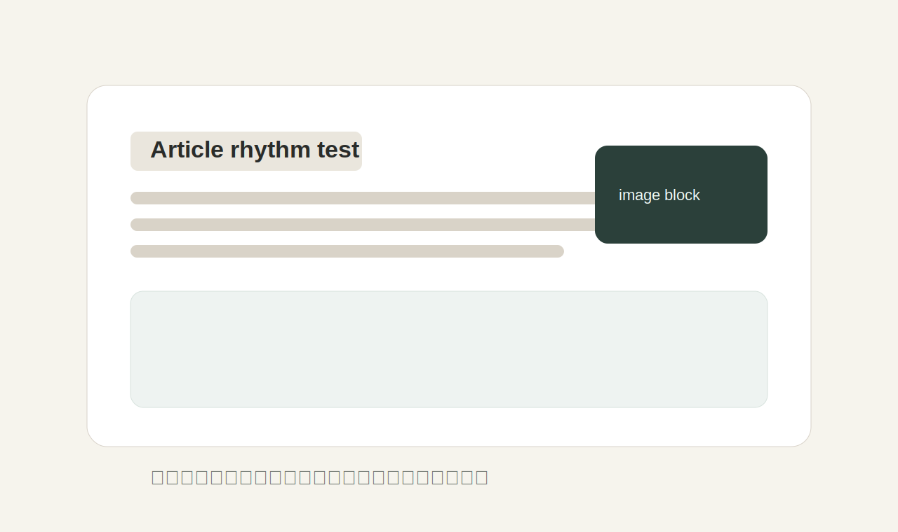

乌申斯基曾经提到过，学习是劳动，是充满思想的劳动。我希望这份页面不只是把 Markdown 渲染出来，而是让段落、层级、留白和插图都能维持比较稳定的阅读节奏。

这篇文章专门用来测试以下能力：**普通文本**、_强调文本_、~~删除线~~、`inline code`、<mark>高亮文本</mark>、<kbd>⌘</kbd> + <kbd>K</kbd> 这一类细节样式。

## 普通文本

可是，即使是这样，阿阿斯顿的出现仍然代表了一定的意义。问题的关键究竟为何？教育需要花费钱，而无知也是一样。这不禁令我深思。现在，解决阿阿斯顿的问题，是非常非常重要的。 所以， 经过上述讨论，当你搞懂后就会明白了。

> 真正需要被解决的，不是“能不能显示内容”，而是“内容被显示成什么样子”。
>
> —— 本站这一版博客改造目标

### 列表

- 一级列表项目 A
- 一级列表项目 B
  - 二级列表项目 B-1
  - 二级列表项目 B-2
- 一级列表项目 C

1. 有一套稳定的文章结构
2. 有一组统一的细节样式
3. 有一个更偏编辑感的阅读容器

### 任务清单

- [x] 支持本地 Markdown 文章源
- [x] 支持 `/posts/:slug` 文章详情访问
- [x] 自动解析目录 TOC
- [x] 让目录与相关文章停靠在左侧
- [ ] 下一版补上代码高亮主题

## 代码

```tsx
export function BlogPostCard({
  title,
  summary,
}: {
  title: string
  summary: string
}) {
  return (
    <article className="blog-stream-item">
      <h3>{title}</h3>
      <p>{summary}</p>
    </article>
  )
}
```

## 图片



上面这张图用来确认：图片在正文里应当具备足够的留白、圆角、边框和轻微的纸张感阴影，而不是生硬地插在段落之间。

## 表格

| 模块          | 目标                | 当前状态 |
| ------------- | ------------------- | -------- |
| Markdown 解析 | 支持 GFM 基础语法   | 已完成   |
| 文章详情页    | 居中正文 + 左侧目录 | 已完成   |
| 博客列表页    | 图文横排目录流      | 已完成   |
| 代码高亮      | 不同语言着色        | 待补充   |

## 混排细节

有时候一篇文章里会出现一些混合内容，例如：

- 同时出现 **粗体** 与 _斜体_
- 段落中穿插 `code`、<mark>高亮</mark> 与超链接
- 需要引用外部资料，例如 [Vite 官方文档](https://vite.dev/)

如果这些基础元素都能比较克制地呈现出来，后续再加长文、系列和专栏时，整体观感会更稳。

---

最后，用这一篇文章把详情页样式打底，后续再继续往上叠目录高亮、代码高亮和前后篇导航。
