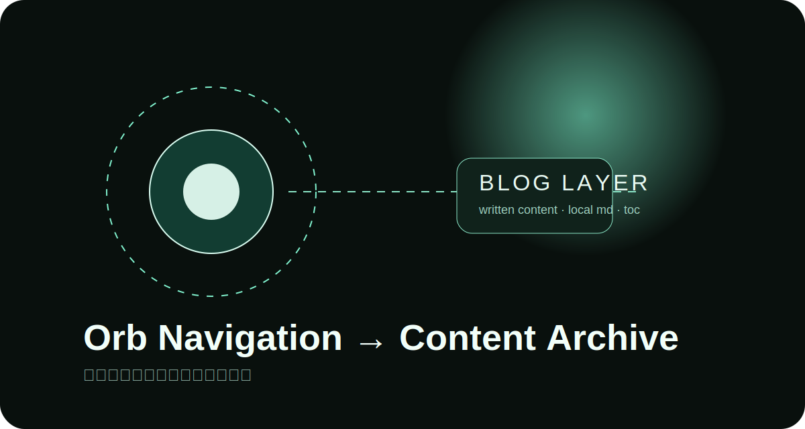
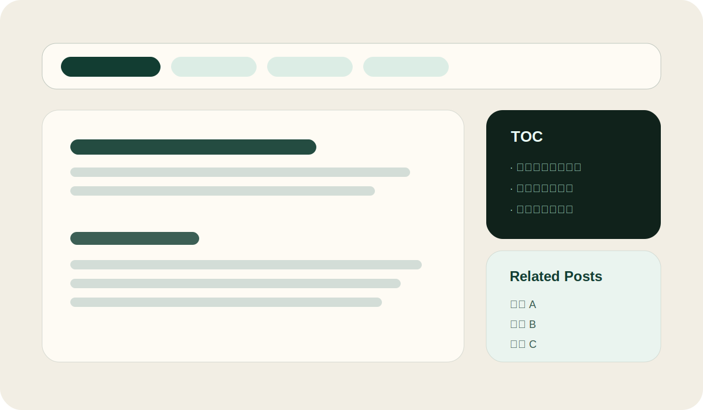

## 为什么先做博客层

目前站点已经有比较明确的视觉骨架：粒子网络背景、球形导航、启动动画和主题切换都已经完成。下一步如果继续只做炫技组件，会让内容承载能力一直偏弱。

所以这次我先把博客系统接进来，让首页和详情页都拥有一个稳定的内容容器。它应该满足三个目标：

1. **写作成本足够低**：新增文章只需要新建一个目录，放入 `index.md` 和配图。
2. **浏览方式足够清晰**：同一批内容可以按发布时间、分类、标签和归档四种方式观看。
3. **细节还得保留站点气质**：不能变成一个和整体氛围割裂的普通文章列表页。

## 目录与资源的组织方式

我没有把文章放进 `public` 目录，而是把文章源放在 `src/content/posts/<slug>/` 下。这样有两个好处：

- 可以直接通过 `import.meta.glob()` 收集文章源；
- 文章内的相对图片路径也可以走构建管线，最终变成带 hash 的资源地址。

如果文章目录像这样：

```text
orbital-interface/
  index.md
  cover-orbit.svg
```

那么 Markdown 里直接写 `` 就能正常工作。

## 页面层的节奏安排



文章总览页顶部放了一个 tab 切换区，切换时不是完全跳去新页面，而是在同一个容器内切换视图：

### 近期发布

适合用卡片快速看最新内容，也能作为之后分页和置顶的入口。

### 分类

偏主题索引，适合把「站点构建」「视觉实验」「性能记录」这种文章放在一起。

### 标签

标签更像临时的切片视图，比如 `#Markdown`、`#Canvas`、`#交互设计`。

### 归档

归档则是时间线入口，适合回看某个月集中完成了什么。

## 接下来还想补什么

后面我想把这套系统再往前推一步：

- 加入文章搜索；
- 增加草稿和系列文章支持；
- 给目录加当前阅读位置高亮；
- 在文章页尾接一个前后篇切换和评论占位区。

现在这一版先把骨架搭稳，确认整体观感再继续推进。
