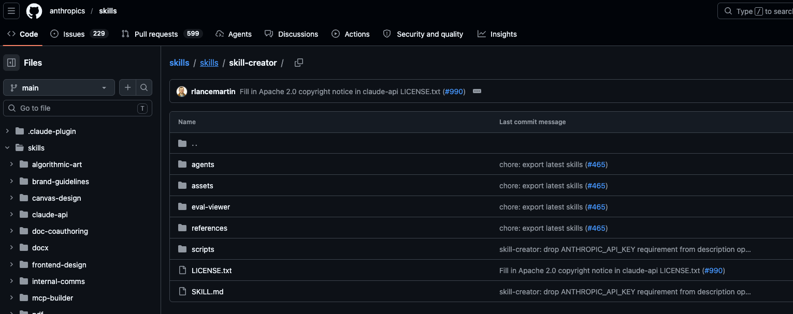

# skills-creator

## 背景：skill困境

问题：

- **写完不确定是否有效**：SKILL.md 写好了，但跑起来效果总是差点意思，不知道是 prompt 写得不对还是结构有问题
- **修改后不知道变好还是变差**：改了几版，感觉越改越乱，缺少客观的评判标准
- **模型更新后 Skill 突然失效**：上个月还好好的，这个月就不灵了
- **触发时机不对**：该触发的时候不触发，不该触发的时候乱触发

这些问题的根源是同一个：**Skill 开发缺乏测试和验证机制**。

skill-creator能把软件工程的严谨性引入 Skill 开发。

## skill-creator是什么

一句话定义：**skill-creator 是一个做 Skill 的 Skill**。

你告诉它你想要什么能力，它就引导你一步步把这个能力输出成一个结构完整、能真正触发、经过测试验证、可持续迭代的 Skill。

## 按照与使用流程

仓库路径：https://github.com/anthropics/skills/tree/main/skills/skill-creator



建议进去全局安装，mac默认安装路径在~/.agents/skills/skill-creator。

### 基本使用

使用方式非常直接，告诉它你想要什么：

```
使用 skill-creator 帮我实现一个 code-review

目标，检测代码中：
- 明显的语法问题、边界问题、异常处理、竞态问题等
- 业务逻辑耦合，可读性和可维护性差
- 不符合项目规范，代码风格差异大
- 潜在的逻辑漏洞或其他 bug

输出问题点，并指出原因和修复建议。
```

接下来 skill-creator 会引导你完成整个流程：

**第一步：需求澄清**

skill-creator 会追问一些边界情况：

- 检查范围是单个文件还是整个目录？
- 是否需要考虑特定的编程语言？
- 输出格式有什么要求？
- 严重程度如何分级？

这些问题帮助把模糊的想法梳理成清晰的需求。

**第二步：生成 SKILL.md**

根据澄清后的需求，skill-creator 自动生成：

- frontmatter（name、description 等元数据）
- Markdown 正文指令
- 如果需要，还会规划 references 和 scripts 目录

**第三步：生成测试用例**

skill-creator 会生成 2-3 个真实的测试 Prompt，模拟用户实际会怎么调用这个 Skill：

```
请帮我 review 一下 src/utils/auth.js 这个文件
```

然后在隔离环境中运行这些测试。

**第四步：评估与迭代**

测试完成后，skill-creator 会：

1. 打开一个 HTML 界面，展示每个测试用例的输入和输出
2. 显示量化指标：通过率、耗时、Token 用量
3. 让你提供反馈：哪里做得好，哪里需要改进

根据你的反馈，skill-creator 会修改 Skill 并重新测试，直到你满意为止。

### 进阶使用

**运行 Benchmark**

当你想量化比较两个版本时：

```
帮我对 code-review skill 运行 benchmark，对比 v1 和 v2
```

skill-creator 会并行运行两个版本的测试，输出详细的对比报告。

**手动触发器优化**

```
帮我优化 code-review skill 的触发描述
```

skill-creator 会生成测试查询集，让你审核后运行优化循环。

## 总结

skill-creator 的核心价值，是把软件工程的严谨性引入 AI 能力构建。

**对开发者的影响**：

- **降低门槛**：不需要是 Prompt 工程专家，也能创建可靠的 Skill
- **提高效率**：Evals、Benchmark、A/B 测试让优化有据可依
- **增强可靠性**：测试捕捉回归，知道何时 Skill 过时

**对 AI 行业的趋势**：

当前，SKILL.md 本质上是"实现计划"——详细指示 Claude 如何做某事。

未来，可能演变为"规范说明"——用自然语言描述 Skill 应该做什么，模型自行解决实现。Evals 已经在描述"what"，最终，描述本身就是 Skill。
