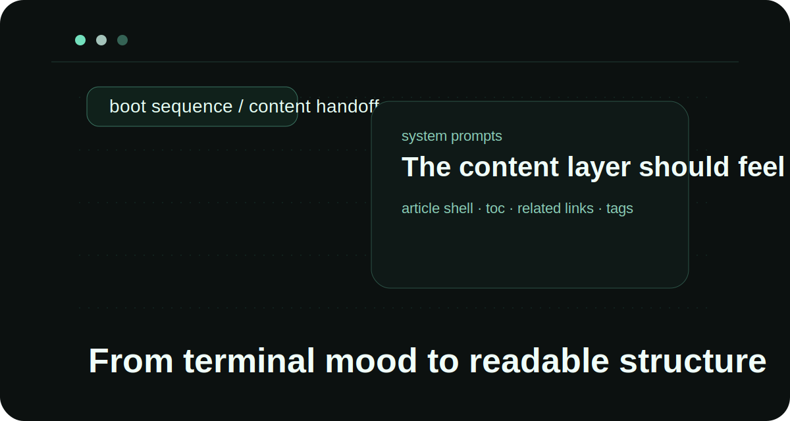
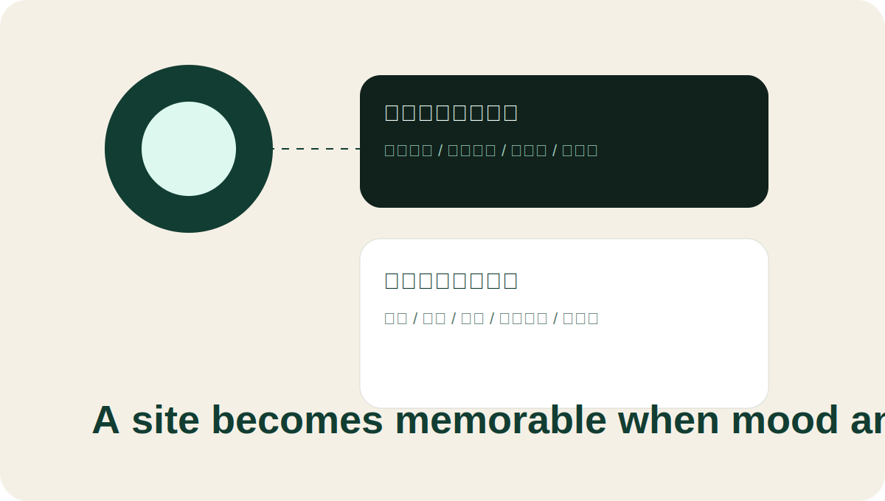

## 终端感不应该只停留在启动页

如果开场是一个很有氛围的终端界面，结果进入正文就立刻变成普通卡片式博客，整个体验会突然塌掉。所以我开始把一些终端语言继续往正文区域渗透：

- 用更克制的发光边框代替高对比描边；
- 让辅助信息排成像日志一样的横向元数据条；
- 把目录、相关文章、标签都做成“控制面板”的感觉。

## 内容不是装饰品，而是第二层舞台

站点里最抓眼球的通常是动画，但真正能留下痕迹的反而是文章。于是我决定把文章页设计成一个二段舞台：

### 第一段是情绪入口

它负责建立气氛，包括背景粒子、导航球、色彩和材质。

### 第二段是信息承载

它负责让人停留，包括标题、目录、段落、插图和可继续阅读的路径。

只有第二段做稳了，前面的动效才不是烟花。

## 这套博客系统给了我什么

这次接入 Markdown 文章源以后，我终于可以在不打断工作流的前提下持续记录：

1. 新建目录就能新写一篇；
2. 同目录图片不会丢；
3. 文章详情页能自动生成目录；
4. 博客首页可以从多个角度浏览内容。

接下来我要做的是把“文章系列”这个概念也接进来，让若干篇文章之间形成明确的阅读顺序。
